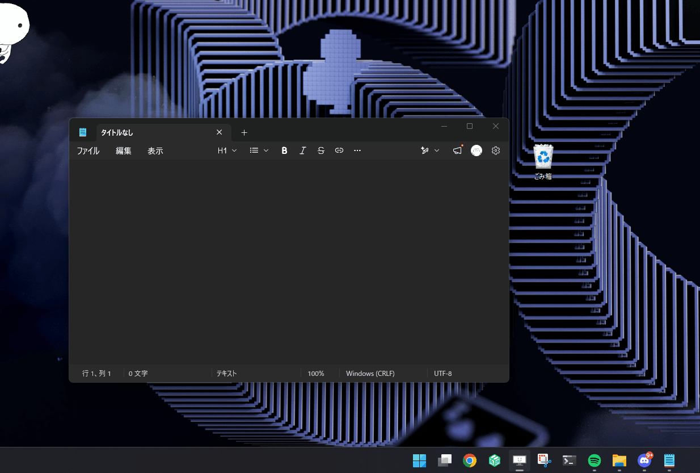
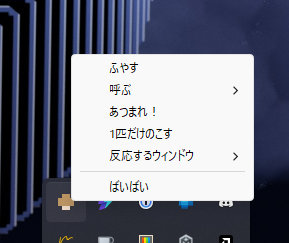
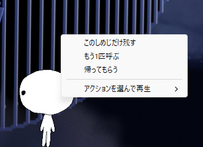
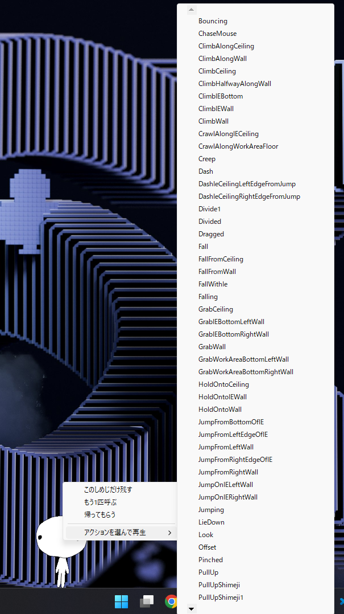

# bunashimeji

🍄 alt-shimeji



## 特徴

- Windows 専用
- Java ランタイム不要。なので省メモリ (100体くらい出しても 1GB はいかない程度)
- オリジナルのしめじ xml も、shimeji-ee の xml もどっちも対応
- 右クリックメニューから任意のアクションを選んで再生できる

## やらないこと

- しめじ・shimeji-ee との完全互換
  - 「だいたい動く」をめざしています
- アクティブなウィンドウの辺にマスコットを投げると辺に掴まるやつ
  - なんか別にいらないかもなって思ったので
- クロスプラットフォーム対応

## 使いかた

1. アーティファクトのリリースからexeをダウンロード
2. zipを展開して、中にある `/img` と `/conf` に追加したいしめじのフォルダを配置
   - 画像一式を `/img/[キャラ名]/`、`Actions.xml` と `Behavior.xml` (もしくは
     `動作.xml` と `行動.xml`) を `/conf/[キャラ名]/` の下に置きます
   - フォルダ名は `/img` と `/conf` で揃えてください
   - こんな感じ
     ```
     bunashimeji/
     ├── bunashimeji.exe
     ├── img/
     │   └── [キャラ名]/
     │       ├── shime1.png
     │       ├── shime2.png
     │       └── ...
     └── conf/
         ├── windows.json
         └── [キャラ名]/
             ├── Actions.xml
             └── Behavior.xml
     ```
3. `bunashimeji.exe` を起動
4. 追加したしめじが降ってくるはず 🍄‍🟫

### タスクトレーのメニュー



タスクトレーのアイコンから操作できます。

- **ふやす**: `/img` にあるキャラからランダムに 1 匹追加します
- **呼ぶ**: `/img` 直下にあるキャラを名指しで 1 匹追加します
- **あつまれ！**: 全員マウスカーソルのほうへ歩いてきます
- **1匹だけのこす**: 1匹だけ残して他にはお帰りいただきます
- **反応するウィンドウ**: しめじが上に乗ったり投げて掴めるウィンドウを ON/OFF
  で切り替えます
- **ばいばい**: 終了します

### しめじを右クリックしたときのメニュー



しめじを右クリックすると、その子個別のメニューが開きます。

- **このしめじだけ残す**:
  右クリックしたしめじだけ残して、他にはお帰りいただきます
- **もう1匹呼ぶ**: 同じキャラの仲間を1匹追加します
- **帰ってもらう**: 右クリックしたしめじだけ消えます
  (最後の1匹を帰すと、そのままアプリも終わります)
- **アクションを選んで再生**:
  そのキャラに設定されているアクションを好きなタイミングで再生できます



お気に入りのアクションがあるときに便利かも。

## Thanks!

- [しめじ - Group Finity (アーカイブ)](https://web.archive.org/web/20160206035319/http://www.group-finity.com/Shimeji/)
- [shimeji-ee - Kilkakon](https://kilkakon.com/shimeji/)
